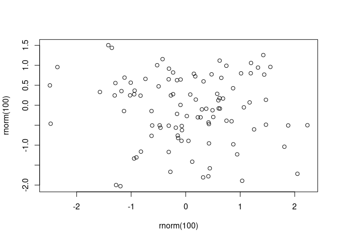

<!-- README.md is generated from README.Rmd. Please edit that file -->

# documentNumbering

<!-- badges: start -->
<!-- badges: end -->

The goal of documentNumbering is to provide figure and table numbering
in Rmd output formats that don’t normally provide figure numbers. This
package exists as an alternative to the number referencing provided by
the [bookdown
package](https://bookdown.org/yihui/rmarkdown-cookbook/figure-number.html).

## Installation

You can currently install from [GitHub](https://github.com/) with:

``` r
# install.packages("remotes")
remotes::install_github("rmflight/documentNumbering")
```

## Examples

### R6 Object

The easiest way to use this is the actual {R6} object, `dn_counter` that
gets updated, and contains all the information for printing, and which
you initialize with whatever values you want for a prefix, and a
character to use to replace any spaces in the prefix.

``` r
library(documentNumbering)
# a normal example in a main manuscript
my_counter = dn_counter$new("Figure ", "_")
my_counter
#>   dn_counter: 
#>       prefix: Figure 
#> file_replace: Figure_
#>        count: 
#>        names: 
#> NULL
# one where you want an "S" in front of the number
s_counter = dn_counter$new("Figure ", "_", "S")
```

When it is initialized, there are no counts, and no names for the
counts.

### Increment the Count

``` r
my_counter$increment("descriptive_name")
my_counter
#>   dn_counter: 
#>       prefix: Figure 
#> file_replace: Figure_
#>        count: 1
#>        names: 
#> [1] "descriptive_name"

s_counter$increment("a_name")
s_counter
#>   dn_counter: 
#>       prefix: Figure 
#> file_replace: Figure_
#>        count: S1
#>        names: 
#> [1] "a_name"
```

Here we can see that the count now includes a “1”, and the
`descriptive_name` we supplied. In the case of the `s_counter`, we can
now see that the “S” gets added directly to the counter, and the count
is actually stored as a character.

### Paste in Text

Now we want to refer to it in the text, we can do:

``` r
my_counter$label_text("descriptive_name")
#> [1] "Figure 1"
```

### Refer to Multiple

Often we want to refer to multiple figures at once:

``` r
# add another entry first
my_counter$increment("descriptive_2")
my_counter$label_text(c("descriptive_name", "descriptive_2"))
#> [1] "Figure 1, 2"
```

### Change Name

If we’ve supplied the incorrect name, we can change it if you really
want (I doubt this comes up much, but it’s there).

``` r
my_counter$rename("descriptive_name", "descriptive_1")
my_counter
#>   dn_counter: 
#>       prefix: Figure 
#> file_replace: Figure_
#>        count: 1, 2
#>        names: 
#> [1] "descriptive_1" "descriptive_2"
```

### File Paths

In addition to just using the counter, there is the ability to modify
the file names of the figures generated. This is particularly useful if
you are creating figure files for a manuscript. If you set
`keep_md: true` in the yaml header, and then you can add a custom figure
processor:

``` yaml
output:
  word_document:
    keep_md: true
```

``` r
knitr::opts_chunk$set(fig.processor = dn_modify_path)
```

And then to rename the figure file, you set a custom chunk option,
`dn_id`:

    ```{r rename_chunk, dn_id = my_counter$label_file("descriptive_1")} r` ''`
    plot(rnorm(100), rnorm(100))
    ```

The figure file will be prepended with `Figure_1_` in the output
directory that is generated, which makes it much easier to refer to when
uploading files or sharing them with collaborators.

Alternatively, you can name the chunk with the id you want to use, and
give the right counter as the `dn_id`.

    ```{r descriptive_1, dn_id = my_counter} r` ''`
    plot(rnorm(100), rnorm(100))
    ```

### Traditional Functional R

For basic usage, you initialize any counters you need:

``` r
library(documentNumbering)

figure_counts = dn_initialize_counter()
table_counts = dn_initialize_counter()
```

From there, you can add to each one with identifiers, and then
subsequently use it to reference it later:

``` r
figure_counts = dn_increment_counter(figure_counts, "plot1")
plot(rnorm(100), rnorm(100))
```



And now you can refer to it in the text:

`r dn_figure_string(figure_counts, "plot1")`. Shows the result of
plotting a random normal.

Figure 1. Shows the result of plotting a random normal.

For table numbers, you can use `dn_table_string`.

Both `dn_table_string` and `dn_figure_string` are wrappers around the
more general `dn_paste_counter`, where you can supply any text you want:

``` r
dn_paste_counter(figure_counts, "Whoa ", "plot1")
#> [1] "Whoa 1"
```

### Disadvantage

You need to define the counter identifier before it can be used. That
can be annoying, but in practice it’s not too bad.

### Modifying Figure Names

In addition to just using the counter, there is the ability to modify
the file names of the figures generated. This is particularly useful if
you are creating figure files for a manuscript. If you set
`keep_md: true` in the yaml header, and then you can add a custom figure
processor:

``` yaml
output:
  word_document:
    keep_md: true
```

``` r
knitr::opts_chunk$set(fig.processor = dn_modify_path)
```

And then to rename the figure file, you set a custom chunk option,
`dn_id`:

    ```{r rename_chunk, dn_id = dn_figure_rename(figure_counts, "plot1")}
    plot(rnorm(100), rnorm(100))
    ```

The figure file will be prepended with `figure_1_` in the output
directory that is generated, which makes it much easier to refer to when
uploading files or sharing them with collaborators.
