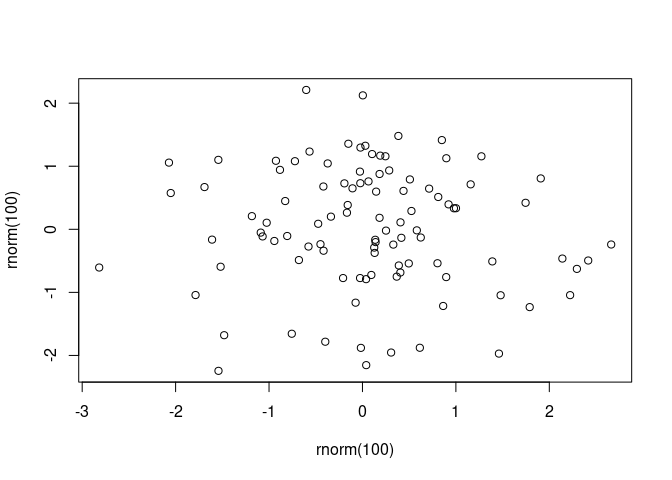

<!-- README.md is generated from README.Rmd. Please edit that file -->

# documentNumbering

<!-- badges: start -->
<!-- badges: end -->

The goal of `documentNumbering` is to provide figure and table numbering
in Rmd / qmd output formats that don’t normally provide figure numbers.
This package exists as an alternative to the number referencing provided
by the [bookdown
package](https://bookdown.org/yihui/rmarkdown-cookbook/figure-number.html)
as well as those provided by `quarto`.

## Installation

You can currently install from [GitHub](https://github.com/) with:

``` r
# install.packages("remotes")
remotes::install_github("rmflight/documentNumbering")
```

## Examples

### R6 Object

The way to use this is the actual {R6} object, `dn_counter` that gets
updated, and contains all the information for printing, and which you
initialize with whatever values you want for a prefix, and a character
to use to replace any spaces in the prefix.

``` r
library(documentNumbering)
# a normal example in a main manuscript
my_counter = dn_counter$new("Figure ", "_")
my_counter
#>   dn_counter: 
#>       prefix: Figure 
#>         link: no
#> file_replace: Figure_
#>        count: 
#>        names: 
#> NULL
# one where you want an "S" in front of the number
s_counter = dn_counter$new("Figure ", "_", "S")
s_counter
#>   dn_counter: 
#>       prefix: Figure 
#>         link: no
#> file_replace: Figure_
#>        count: 
#>        names: 
#> NULL
```

When it is initialized, there are no counts, and no names for the
counts.

### Increment the Count

``` r
my_counter$increment("descriptive_name")
my_counter
#>   dn_counter: 
#>       prefix: Figure 
#>         link: no
#> file_replace: Figure_
#>        count: 1
#>        names: 
#> [1] "descriptive_name"

s_counter$increment("a_name")
s_counter
#>   dn_counter: 
#>       prefix: Figure 
#>         link: no
#> file_replace: Figure_
#>        count: S1
#>        names: 
#> [1] "a_name"
```

Here we can see that the count now includes a “1”, and In the case of
the `s_counter`, we can now see that the “S” gets added directly to the
counter, and the count is actually stored as a character.

We can also add multiple items at a time:

``` r
my_counter$increment(c("b_name",
                       "c_name"))
```

### Paste in Text

Now we want to refer to it in the text, we can do:

``` r
my_counter$label_text("descriptive_name")
#> [1] "Figure 1"
```

### Refer to Multiple

Often we want to refer to multiple figures at once:

``` r
# add another entry first
my_counter$increment("descriptive_2")
my_counter$label_text(c("descriptive_name", "descriptive_2"))
#> [1] "Figures 1-4"
```

### Change Name

If we’ve supplied the incorrect name, we can change it if you really
want (I doubt this comes up much, but it’s there).

``` r
my_counter$rename("descriptive_name", "descriptive_1")
my_counter
#>   dn_counter: 
#>       prefix: Figure 
#>         link: no
#> file_replace: Figure_
#>        count: 1, 2, 3, 4
#>        names: 
#> [1] "descriptive_1" "b_name"        "c_name"        "descriptive_2"
```

### Links Between Text and Caption

When generating both HTML and Word output, you often want links to be
available between items in the HTML output. You can control whether link
text is input with the `link` option, and then label text with
`label_text` and captions with `label_caption`.

``` r
link_counter = dn_counter$new("Figure ", link = "yes")
link_counter$increment("a-name")
link_counter$label_text("a-name")
#> [1] "<a href=\"#a-name\">Figure 1</a>"
link_counter$label_caption("a-name")
#> [1] "<a id=\"a-name\">Figure 1</a>"
```

There is something to note, if you are using quarto documents, you
cannot use chunk labels that start with `fig` or `tbl`, because then
they will require `fig-cap` and `tbl-cap`. However, you can use labels
that start with `figure` and `table` so they are easier to see in an
outline list.

One limitation of having linking, is the inability to label multiples,
currently. This may or may not be fixed eventually, but it will require
a bunch more logic to the `label_text` function.

### File Paths

In addition to just using the counter, there is the ability to modify
the file names of the figures generated. This is particularly useful if
you are creating figure files for a manuscript. If you set
`keep_md: true` in the yaml header, and then you can add a custom figure
processor, `modify_path`, which is one of the functions in the
`dn_counter` object you instantiate:

For `rmarkdown`:

``` yaml
output:
  word_document:
    keep_md: true
```

For `quarto`:

``` yaml
output:
  docx:
    keep-md: true
```

``` r
figure_count = dn_counter$new()
knitr::opts_chunk$set(fig.process = figure_count$modify_path)
figure_count$increment(c("plot", "plot2"))
```

And then to rename the figure file, you set the chunk **label** to be
the same as the figure number you want to access:

```` markdown
```{r}
#| label: plot
plot(rnorm(100), rnorm(100))
```
````



Alternatively:

```` markdown
```{r plot2}
plot(rnorm(100), rnorm(100))
```
````


The figure file will be prepended with `Figure_1-` in the output
directory that is generated, which makes it much easier to refer to when
uploading files or sharing them with collaborators.
